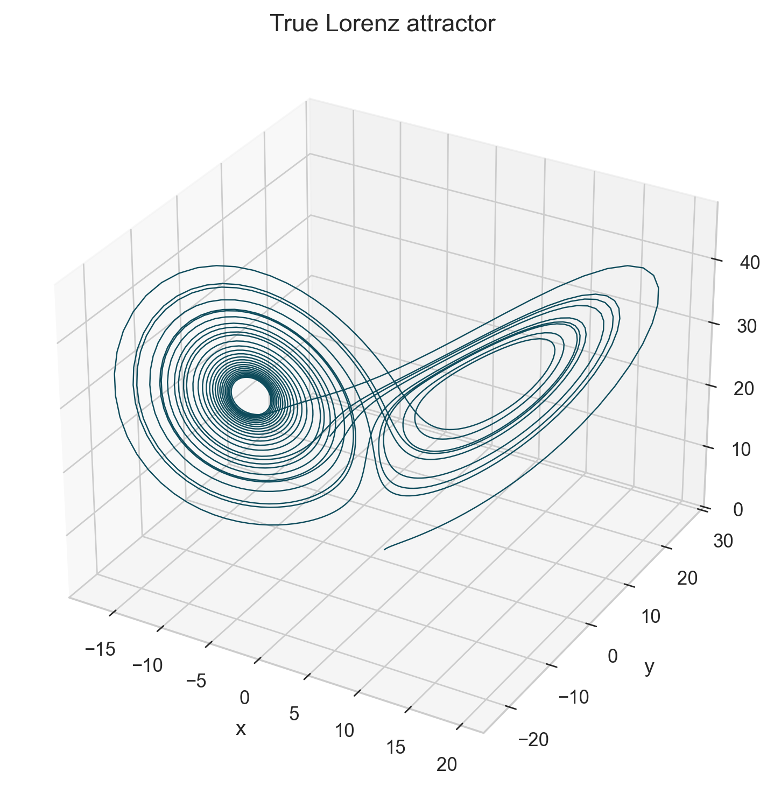
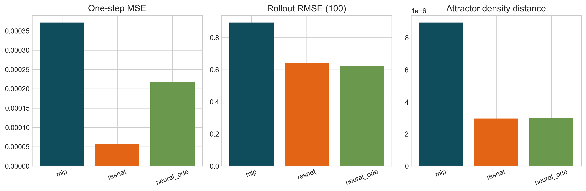

# Learning Chaotic Continuous-Time Dynamics on the Lorenz System

Numerical Simulation, Short-Horizon Forecasting, and Attractor Reconstruction

This repository is a compact research-style codebase for a Scientific Machine Learning course project. We use the Lorenz system as a canonical chaotic benchmark to compare classical numerical simulation, discrete-time neural forecasting baselines, and a Neural ODE continuous-time model under a shared reproducible pipeline.

## Motivation

Chaotic systems are an unusually good SciML stress test. A model can achieve low one-step prediction error while still failing badly under recursive rollout because nearby trajectories diverge exponentially. This project is built around that mismatch: we evaluate not only local prediction error, but also attractor geometry, phase portraits, and robustness to noise and time-step changes.

## Problem Setup

We study the Lorenz system

```text
x' = sigma (y - x)
y' = x (rho - z) - y
z' = x y - beta z
```

with the standard chaotic parameters `sigma = 10`, `rho = 28`, and `beta = 8/3`.

## Research Questions

1. Can an MLP learn accurate one-step Lorenz prediction?
2. Does good one-step prediction imply stable multi-step rollout?
3. Does a Neural ODE better capture the underlying continuous-time vector field?
4. Can learned models reconstruct attractor geometry even after pointwise trajectories diverge?
5. How robust are the models to observation noise, initial-condition shifts, and step-size changes?

## Repository Highlights

- Reproducible Lorenz trajectory generation with fixed seeds and saved metadata.
- Three learning baselines: `MLP`, `ResNet` increment predictor, and `Neural ODE`.
- Shared config-driven training, evaluation, comparison, and figure-generation scripts.
- Publication-ready plots for attractors, time series, phase portraits, rollout error curves, and robustness experiments.
- Supporting docs for the mathematical background, experiment plan, 2-page report, and 12-minute presentation.

## Repository Map

```text
configs/        YAML experiment configs
docs/           math, plan, and presentation notes
src/            simulation, data, models, training, evaluation, visualization
scripts/        reproducible CLI entry points
results/        generated data, checkpoints, logs, tables, and report assets
tests/          lightweight regression tests
```

## Installation

Recommended Python version: `3.11`.

```bash
conda env create -f environment.yml
conda activate lorenz-sciml
```

Or with pip:

```bash
python -m venv .venv
source .venv/bin/activate
pip install -r requirements.txt
```

## Quickstart

Generate the Lorenz dataset:

```bash
python scripts/generate_data.py --config configs/data_default.yaml
```

Train all three models:

```bash
python -m src.training.train_mlp --config configs/train_mlp.yaml
python -m src.training.train_resnet --config configs/train_resnet.yaml
python -m src.training.train_neural_ode --config configs/train_neural_ode.yaml
```

Evaluate and compare them:

```bash
python -m src.evaluation.evaluate_model --model mlp --config configs/eval_default.yaml
python -m src.evaluation.evaluate_model --model resnet --config configs/eval_default.yaml
python -m src.evaluation.evaluate_model --model neural_ode --config configs/eval_default.yaml
python -m src.evaluation.compare_models --config configs/eval_default.yaml
python -m src.evaluation.robustness --config configs/ablation_noise.yaml
python -m src.visualization.make_report_figures --config configs/eval_default.yaml
```

Full end-to-end reproduction:

```bash
bash scripts/reproduce_main_results.sh
```

## Main Results Storyline

- Low one-step MSE is achievable for all three learned models.
- Recursive rollout error still grows quickly because Lorenz dynamics are chaotic.
- Residual parameterization often improves local rollout stability over direct next-state prediction.
- The Neural ODE is the most natural model for vector-field learning and step-size transfer.
- Attractor reconstruction and projected density overlap are more informative long-horizon diagnostics than raw pointwise trajectory matching.

## Reproducing Figures

All generated figures are written to `results/figures/`, and report-ready copies are written to `results/report_assets/`.

Representative outputs after running the pipeline:




## Reproducibility Notes

- All major scripts are config-driven and save the config used for each run.
- Datasets are split by trajectory, not by individual time points.
- Training summaries, checkpoints, and evaluation summaries are saved under `results/`.
- `torchdiffeq` is supported when available, with a built-in RK4 fallback for the Neural ODE.
- No final results depend on notebook-only logic.

## Future Work

- Partial-observation learning and state reconstruction.
- Parameter-shift generalization, especially around `rho`.
- Derivative supervision and hybrid state/field losses.
- Conservative Lyapunov-style diagnostics for qualitative chaos analysis.
